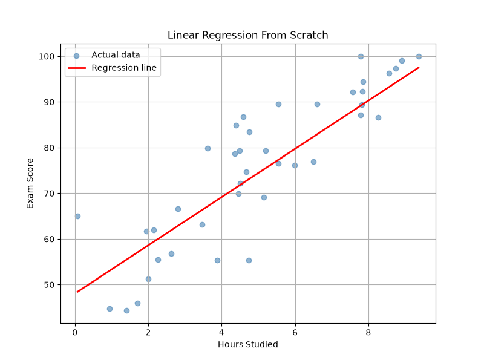
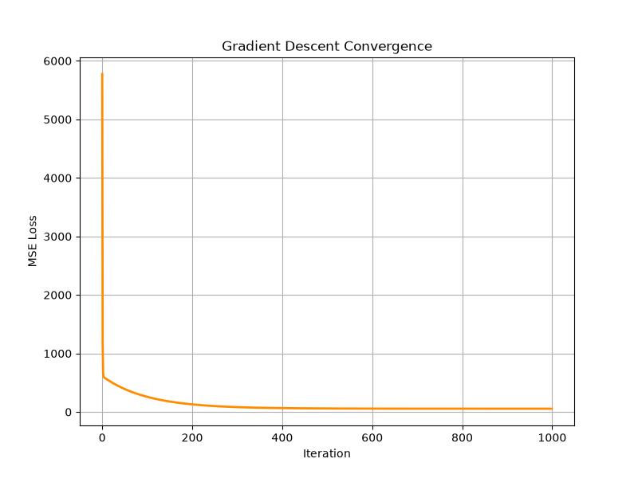

# Linear Regression From Scratch

A machine learning project implementing Linear Regression from scratch using NumPy, without relying on Scikit-Learn for model training.

The project covers the complete machine learning workflow:

* Dataset generation and loading
* Train/test splitting
* Linear Regression
* Gradient Descent
* Mean Squared Error (MSE)
* Root Mean Squared Error (RMSE)
* R² Score
* Loss visualization
* Regression-line visualization
* Comparison with Scikit-Learn

---

## Objective

The objective of this project is to understand how Linear Regression works internally by implementing the algorithm and evaluation metrics manually using NumPy.

Instead of directly using a machine learning library's regression model, the core training process is implemented from scratch.

---

## What is Linear Regression?

Linear Regression is a supervised learning algorithm used to model the relationship between an input variable and a continuous target variable.

For a single feature:

ŷ = wx + b

where:

* `w` = model weight
* `x` = input feature
* `b` = intercept
* `ŷ` = predicted value

In this project, the model predicts a student's performance based on the number of hours studied.

---

## Dataset

The dataset contains:

* `hours_studied` — input feature
* `performance` — target variable

The project uses 200 generated samples with controlled noise.

---

## Training with Gradient Descent

The model parameters are learned using Batch Gradient Descent.

The algorithm repeatedly:

1. Calculates predictions
2. Calculates the error
3. Computes gradients
4. Updates the weight and intercept
5. Minimizes the Mean Squared Error

The loss function used is Mean Squared Error:

MSE = (1/n) × Σ(yᵢ - ŷᵢ)²

---

## Evaluation Metrics

The implementation includes three metrics from scratch:

### Mean Squared Error

Measures the average squared prediction error.

### Root Mean Squared Error

RMSE = √MSE

RMSE is expressed in the same units as the target variable.

### R² Score

Measures how much of the variation in the target is explained by the model.

---

## Project Structure

```text
linear-regression-from-scratch/
│
├── data/
│   ├── dataset.csv
│   └── multiple_regression_dataset.csv
│
├── notebooks/
│
├── plots/
│   ├── linear_regression_fit.png
│   └── loss_curve.png
│
├── src/
│   ├── linear_regression.py
│   ├── multiple_linear_regression.py
│   ├── ridge_regression.py
│   ├── scaling.py
│   ├── feature_scaling.py
│   ├── metrics.py
│   ├── diagnostics.py
│   ├── model_diagnostics.py
│   ├── sklearn_comparison.py
│   └── utils.py
│
├── main.py
├── requirements.txt
├── LICENSE
└── README.md
```

---

## Results

The final single-feature Linear Regression model was trained using:

* Training samples: 160
* Testing samples: 40
* Learning rate: 0.01
* Iterations: 1000

### From-Scratch Model

| Metric | Training | Testing |
| ------ | -------: | ------: |
| MSE    |  55.2010 | 63.3204 |
| RMSE   |   7.4297 |  7.9574 |
| R²     |   0.8067 |  0.7590 |

### Learned Parameters

* Weight = 5.2813
* Intercept = 48.0352

---

## Comparison with Scikit-Learn

The from-scratch implementation was compared against Scikit-Learn's Linear Regression using the same dataset and train/test split.

| Metric    | From Scratch | Scikit-Learn |
| --------- | -----------: | -----------: |
| Test MSE  |      63.3204 |      63.4524 |
| Test RMSE |       7.9574 |       7.9657 |
| Test R²   |       0.7590 |       0.7585 |

The results are very close.

Small differences are expected because the from-scratch implementation uses Gradient Descent with a fixed learning rate and number of iterations, while Scikit-Learn computes the regression solution directly.

---

## Visualizations

### Regression Line

The regression plot shows the test data points together with the learned regression line.



### Loss Curve

The loss curve shows how the Mean Squared Error decreases during gradient descent.



---

## Technologies Used

* Python
* NumPy
* Pandas
* Matplotlib
* Scikit-Learn

Scikit-Learn is used only as a reference implementation for comparison.

---

## How to Run

Clone the repository and install the dependencies:

```bash
pip install -r requirements.txt
```

Run the complete pipeline:

```bash
python main.py
```

The pipeline will:

1. Load the dataset
2. Split the data
3. Train Linear Regression from scratch
4. Generate predictions
5. Calculate evaluation metrics
6. Generate plots
7. Compare the implementation with Scikit-Learn

---

## What I Learned

Through this project, I learned:

* How Linear Regression works mathematically
* How Gradient Descent optimizes model parameters
* How model predictions are generated
* How regression metrics are calculated
* Why feature scaling matters
* How to analyze residuals
* How regularization affects Linear Regression
* How to compare a custom ML implementation with a standard library implementation
* How to structure a machine learning project into reusable modules

---

## Future Improvements

Possible future extensions include:

- Polynomial Regression
- More advanced optimization algorithms
- Cross-validation
- Hyperparameter tuning
- Additional regularization techniques
- A small interactive prediction interface
- More extensive automated testing

---

## Author

**Laxmipriya Biswal**

This project was created as part of my learning journey in Machine Learning and Python, with a focus on understanding Linear Regression from first principles.

---

## License

This project is licensed under the MIT License.